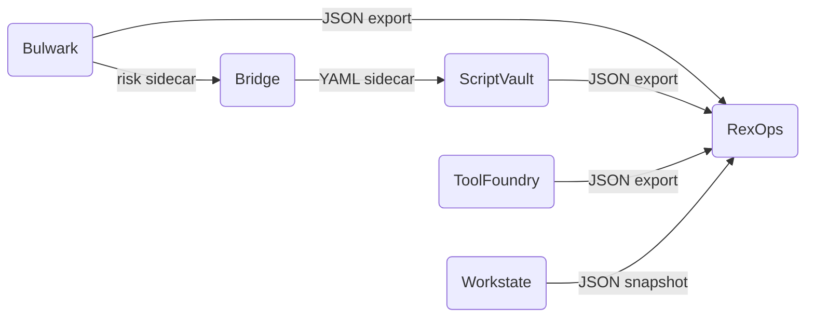

# Linux Ops Suite

> A personal Linux operations toolkit built from focused, single-purpose tools that work together through clean file-based contracts.

---

## Tools

| Tool | Role | Status |
|---|---|---|
| [**Bulwark**](https://github.com/tom2025b/bulwark) | Read-only scanner and risk classifier for scripts and executables | Active |
| [**ScriptVault**](https://github.com/tom2025b/scriptvault) | Fast fuzzy-search TUI script launcher with favorites and recents | Active |
| [**Bridge**](https://github.com/tom2025b/toolbox-bridge) | Lightweight file-based connector between Bulwark and ScriptVault | Active |
| [**ToolFoundry**](https://github.com/tom2025b/toolfoundry) | Tool lifecycle manager — tracks ownership, health, and install state | In progress |
| [**Workstate**](https://github.com/tom2025b/workstate) | Read-only terminal dashboard for project and repository health | Architecture |
| [**RexOps**](https://github.com/tom2025b/rexops) | Operations cockpit — the single consumer of all tool exports | Planned |

---

## How the Pieces Fit

All data flows in one direction through files. No tool imports another tool's code. RexOps is the only consumer — it is where everything comes together.

---

## Design Principles

1. **One job per tool.** Each tool solves exactly one problem and stays inside that boundary.
2. **File-based contracts.** Tools communicate through JSON or YAML — never through shared code or direct calls.
3. **Read-only by default.** Tools that only need to observe never mutate.
4. **Offline and private.** No telemetry. No unnecessary network calls. XDG-compliant config.
5. **Low-resource.** Built to run well on a modest Linux machine without competing for headroom.
6. **Rust-first.** Chosen for performance, safety, and long-term reliability.

---

## Repository Index

Each tool lives in its own repository. This repo is the front door.

| Repository | Description |
|---|---|
| [tom2025b/bulwark](https://github.com/tom2025b/bulwark) | Risk scanner |
| [tom2025b/scriptvault](https://github.com/tom2025b/scriptvault) | Script launcher |
| [tom2025b/toolbox-bridge](https://github.com/tom2025b/toolbox-bridge) | Bulwark → ScriptVault connector |
| [tom2025b/toolfoundry](https://github.com/tom2025b/toolfoundry) | Tool lifecycle manager |
| [tom2025b/workstate](https://github.com/tom2025b/workstate) | Repo health dashboard |
| [tom2025b/rexops](https://github.com/tom2025b/rexops) | Operations cockpit |

---

Built by [@tom2025b](https://github.com/tom2025b) · All repos tagged [`linux-ops-suite`](https://github.com/search?q=topic%3Alinux-ops-suite+user%3Atom2025b&type=repositories)
